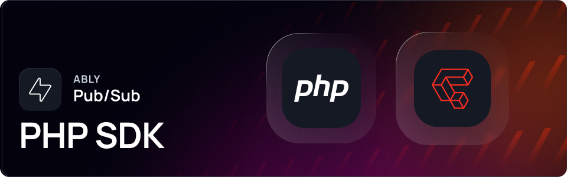

[](https://packagist.org/packages/ably/ably-php)
[](https://github.com/ably/ably-php/blob/main/LICENSE)

---

# Ably Pub/Sub PHP SDK

Build using Ably’s Pub/Sub PHP SDK, supported on all popular platforms and frameworks.

Ably Pub/Sub provides flexible APIs that deliver features such as pub-sub messaging, message history, presence, and push notifications. Utilizing Ably’s realtime messaging platform, applications benefit from its highly performant, reliable, and scalable infrastructure.

Find out more:

* [Ably Pub/Sub docs.](https://ably.com/docs/basics)
* [Ably Pub/Sub examples.](https://ably.com/examples?product=pubsub)

---

## Getting started

Everything you need to get started with Ably:

* [Getting started with Pub/Sub using PHP.](https://ably.com/docs/getting-started/php)
* [SDK Setup for PHP.](https://ably.com/docs/getting-started/setup?lang=php)

---

## Supported platforms

Ably aims to support a wide range of platforms. If you experience any compatibility issues, open an issue in the repository or contact [Ably support](https://ably.com/support).

> [!IMPORTANT]
> PHP SDK versions < 1.1.9 will be [deprecated](https://ably.com/docs/platform/deprecate/protocol-v1) from November 1, 2025.

---

## Installation

To get started with your project, install the package:

```sh
composer require ably/ably-php
```
---

## Usage

The following code connects to Ably's REST messaging service, gets reference to a channel to receive messages, and publishes a test message to that same channel:

```php
// Initialize Ably REST client
$ably = new AblyRest(['key' => 'your-ably-api-key', 'clientId' => 'me']);

// Get a reference to the 'test-channel' channel
$channel = $ably->channel('test-channel');

// Publish a test message to the channel
$channel->publish('test-event', 'hello world');
```

## Releases

The [CHANGELOG.md](./CHANGELOG.md) contains details of the latest releases for this SDK. You can also view all Ably releases on [changelog.ably.com](https://changelog.ably.com).

---

## Contributing

Read the [CONTRIBUTING.md](./CONTRIBUTING.md) guidelines to contribute to Ably.

---

## Support, feedback, and troubleshooting

For help or technical support, visit the [Ably Support page](https://ably.com/support).

### Ably REST API

This SDK currently supports only the [Ably REST API](https://www.ably.com/docs/rest). For realtime capabilities, you can use the [MQTT adapter](https://www.ably.com/docs/mqtt) alongside [Mosquitto PHP](https://github.com/mgdm/Mosquitto-PHP) to implement Ably's Realtime features.